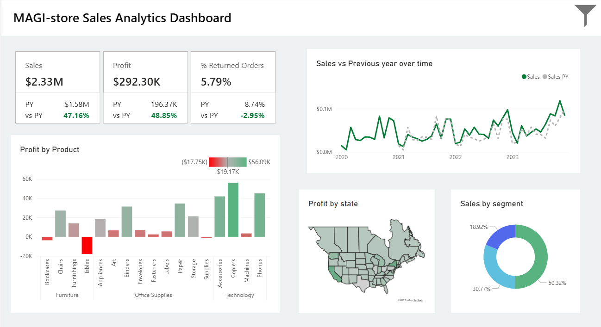
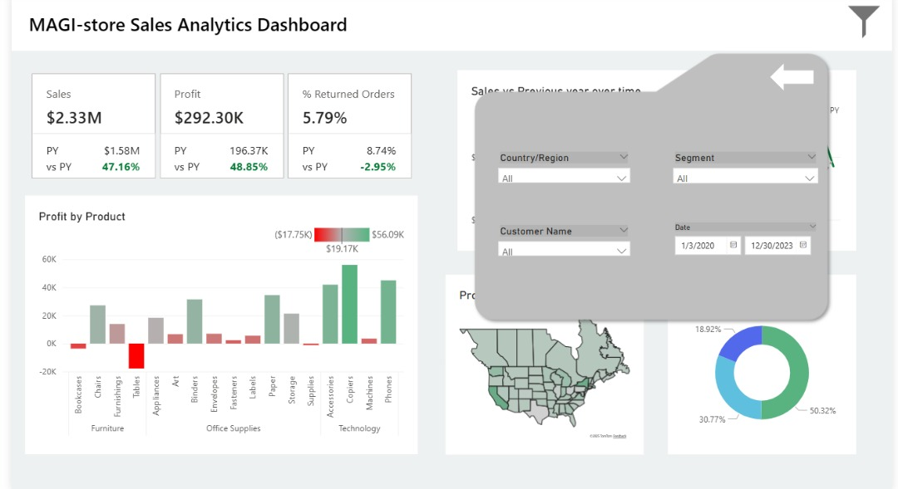

# Magi-store Sales & Profit Dashboard

## Project Description

This is a comprehensive analytics dashboard designed for a "Magi-store" management team. The dashboard provides a "single-pane-of-glass" view of the company's health, focusing on three core areas: **Sales Performance**, **Profitability**, and **Operational Efficiency** (Returns).

The goal is to translate raw transactional data into actionable insights, allowing a manager to instantly answer questions like:
* "Are we hitting our sales and profit goals compared to last year?"
* "Which products are driving our profits, and which are costing us money?"
* "Which states are our most profitable markets?"
* "Who are our most valuable customer segments?"

## Key Features & Visualizations

### 1. Executive KPIs
A set of high-level cards displaying the most critical metrics:
* **Total Sales ($2.33M):** With a +47.16% year-over-year (YoY) growth.
* **Total Profit ($292.30K):** Showing a strong +48.85% YoY growth.
* **% Returned Orders (5.79%):** A key operational metric, showing a favorable decrease of -2.95% from the previous year.

### 2. Time Series: Sales vs. Previous Year
A line chart that tracks sales trends over time, comparing current year (CY) sales against the previous year (PY). This is essential for identifying seasonality and the impact of sales initiatives.

### 3. Profit by Product
A bar chart that breaks down profit by product sub-category, grouped by the main categories (Furniture, Office Supplies, Technology). This visual immediately identifies which products are draining profit (e.g., Tables, Furnishings) and which are the most significant profit centers (e.g., Copiers, Phones).

### 4. Profit by State
A choropleth map of the United States, color-coded by profit. This geographic view helps identify high-performing and low-performing regions, guiding decisions on regional strategy, marketing spend, or logistics.

### 5. Sales by Segment
A donut chart that segments total sales by customer type:
* **Consumer** (50.32%)
* **Corporate** (30.77%)
* **Home Office** (18.92%)

This helps the marketing and sales teams understand their primary customer base.

### 6. Dynamic Filter Panel
A pop-out panel that appears and disappears with a button click. This panel holds key slicers (e.g., for Date, Region, or Segments) to filter the entire report, allowing for a clean, uncluttered main view.

## Technical Details
* **Tool:** **Microsoft Power BI**. All data modeling, DAX measures, and visualizations were built within Power BI.
* **Dataset:** The dashboard uses the public "Superstore" sample dataset, which includes 9,994 records of fictional sales data.

## Future Enhancements

* **Drill-Down:** Add drill-down functionality to the "Profit by Product" chart to see individual product performance.
* **Customer Analysis:** Create a separate page for a deep dive on customer-level analytics (e.g., Top N Customers, RFM Analysis).
* **Forecasting:** Implement Power BI's built-in forecasting on the main sales chart.
